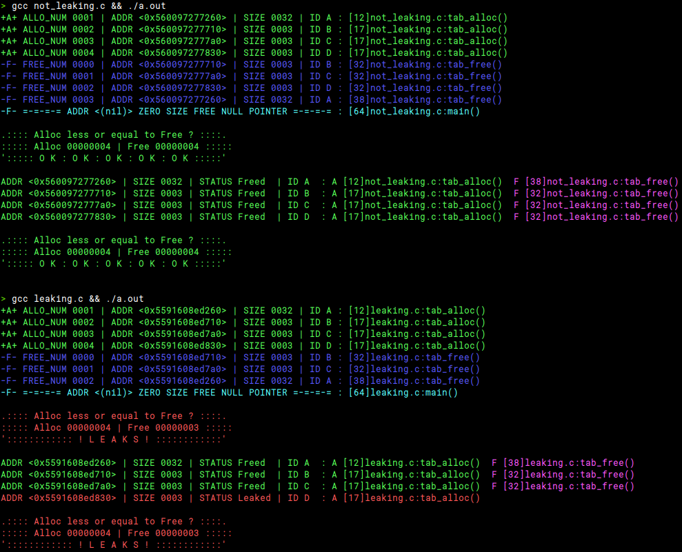

```bash
curl https://raw.githubusercontent.com/lorenuars19/wraloc/master/wraloc.h -o wraloc.h
```


# W R A L O C
- Replaces `malloc()` & `free()` using macros
- Count valid `malloc()` and count non-NULL `free()` ONLY
- Use of GCC's `__attribute__` to execute code before and after the `main()`
- Prints the **size of allocation in bytes** and **location of the call** when `free()` / `malloc()` is called.

# Usage
1. Get
```bash
curl https://raw.githubusercontent.com/lorenuars19/wraloc/master/wraloc.h -o wraloc.h
```
2. Include
```c
#include "wraloc.h"
```

# Screenshots



# Note
WRALOC is activated by default to disable it compile with ```-D WRAP=0 ```
