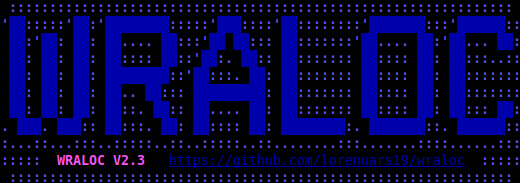
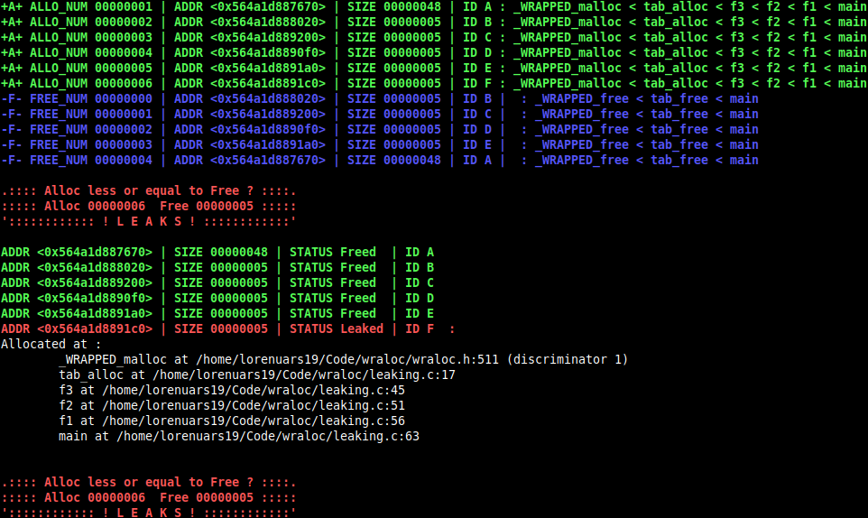
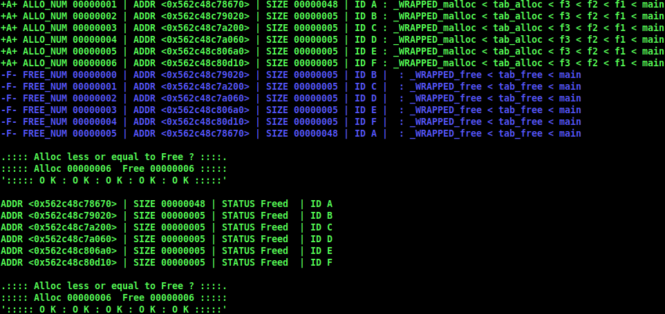

# W R A L O C
- Replaces `malloc()` & `free()`
- Count valid `malloc()` or `exit()` & count non-NULL `free()`
- Use of GCC's `__attribute__` to execute code before an after the `main()`

# Usage
1. Get
  - `curl https://raw.githubusercontent.com/lorenuars19/wraloc/master/wraloc.h -o wraloc.h`
2. Include
  - ` # include "wraloc.h" `
3. Use ` _get_summary() ` to print a summary
4. WRALOC is activated by default to disable it compile with ` -D WRAP=0 `
5. If you compile with ` -g3 ` wraloc will be able to print stack traces
6. You can compile with ` -D _FULL_TRACE_=1 ` to print full stack trace at every operation (prints a lot)
7. You can compile with ` -D _LEAKS_ONLY_=1 ` to print leaked addresses only (useful when you have plenty)
# Dependency
- To be able to print the call stack it depends on a unix utility `addr2line`
- On a MacOs system you should be able to get it using `port install binutils` via `MacPorts`
# Screenshots

