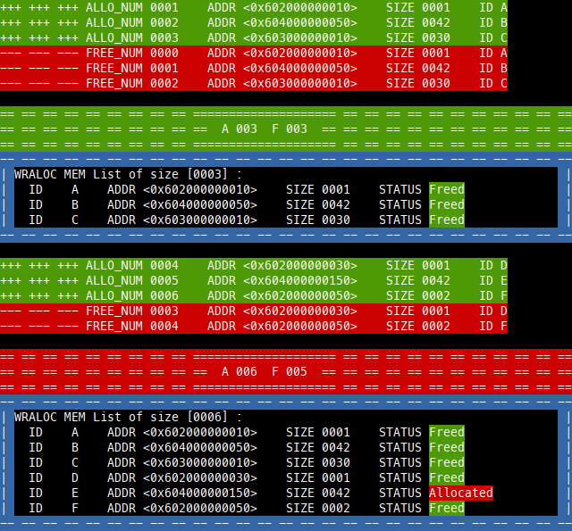

# WRALOC
- Replaces `malloc()` & `free()`
- Count valid `malloc()` or `exit(1)` & count non-NULL `free()` 
- Wraps `main()`

# USAGE
1. Get
  - `curl https://raw.githubusercontent.com/lorenuars19/wraloc/master/wraloc.h -o wraloc.h`
2. Include
  - `# include "wraloc.h"`
3. Use `_get_summary()` to print a summary
4. WRALOC is activated by default to disable it compile with `-D WRAP=0`
